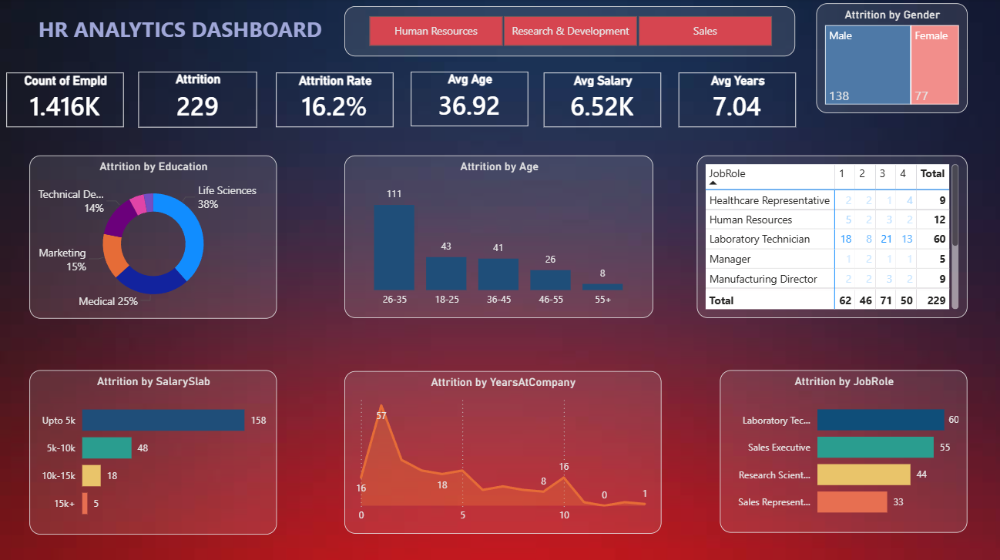

# HR-Analytics
# HR Analytics Dashboard (Power BI)

## 📌 Project Overview

This HR Analytics Dashboard provides insights into employee attrition and workforce demographics using Microsoft Power BI. The dashboard helps HR teams identify attrition trends, employee distribution, salary patterns, and job role analysis for better decision-making.

---

## 🎯 Objectives

- Monitor employee attrition
- Analyze attrition by various factors
- Identify departments with high attrition
- Understand employee demographics
- Support HR decision making

---

## 📊 Dashboard KPIs

- Total Employees
- Attrition Count
- Attrition Rate
- Average Age
- Average Salary
- Average Years at Company

---

## 📈 Dashboard Visualizations

- Attrition by Education
- Attrition by Age Group
- Attrition by Salary Slab
- Attrition by Years at Company
- Attrition by Job Role

---

## 🛠 Tools Used

- Microsoft Power BI
- Power Query
- DAX
- Data Modeling

---

## Dataset

HR Employee Attrition Dataset

Columns include:

- Employee ID
- Age
- Education
- Salary
- Job Role
- Years at Company
- Attrition
- Department
- Gender

---

## Key Insights

- Identified job roles with highest attrition.
- Salary slabs with maximum employee turnover.
- Age groups contributing most to attrition.
- Education level impact on employee retention.
- Average employee experience and salary trends.

---

## Dashboard Preview

(Add dashboard screenshot here)

---

## Skills Demonstrated

- Data Cleaning
- Data Modeling
- DAX Measures
- Power Query
- Interactive Dashboard Design
- KPI Cards
- Data Visualization
- Business Insights

---

## Author

Snehal Shinde
